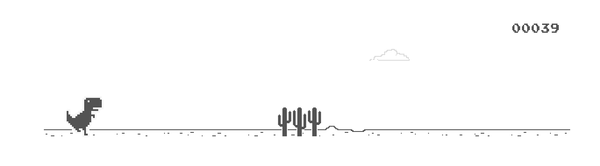

# react-chrome-dino

## Usage:



Demo: https://mhasbini.com/miscs/react-chrome-dino-demo/index.html

Install:

```
yarn add react-chrome-dino
```

```js
import React from 'react';
import ChromeDinoGame from 'react-chrome-dino';

const App = () => (
  <ChromeDinoGame />
);

export default App;
```

Check [`src/demo`](src/demo) for a usage example.

## License

This library is licensed under MIT.

The game javascript & css is licensed under BSD as follow:

```
// Copyright (c) 2014 The Chromium Authors. All rights reserved.
// Use of this source code is governed by a BSD-style license that can be
// found in the LICENSE file here: https://cs.chromium.org/chromium/src/LICENSE. 
```

## Available Scripts

In the project directory, you can run:

### `npm start` or `yarn start`

Runs the library in development mode. Open [http://localhost:3000](http://localhost:3000) to view it in the browser.

### `npm run test` or `yarn run test`

Runs the test watcher in an interactive mode.

### `npm run build` or `yarn build`

Builds the library for production to the `build` folder.
It correctly bundles React in production mode and optimizes the build for the best performance.

### `npm publish`

Publishes the library to NPM.
